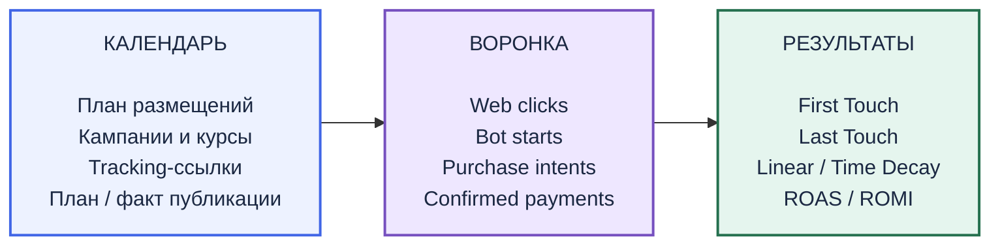

# Поступашки — маркетинговая аналитика

**Команда «Наступашки»**

Исторические данные не позволяют достоверно связать продажу с конкретным Telegram-размещением. Наш MVP планирует новые размещения, выпускает уникальные ссылки, наблюдает Telegram-воронку и связывает отдельно подтверждённые оплаты с маркетинговыми касаниями. Историческая атрибуция остаётся сценарной моделью с явным предупреждением.

- [Публичный MVP](https://demo-komandy-postupili.postupili-demo.workers.dev)
- [PDF решения](мвп/public/solution.pdf)
- [Telegram: @tracker_marketing_bot](https://t.me/tracker_marketing_bot)

## Как работает решение


**PurchaseIntent — это намерение купить / переход к менеджеру. Подтверждённая выручка появляется только после отдельного Payment.**

## Три экрана MVP



**Календарь.** Планирование размещений, выпуск уникальных ссылок и фиксация фактической публикации.

**Воронка.** Наблюдаемый путь пользователя от перехода до намерения купить и отдельно подтверждённой оплаты.

**Результаты.** Сравнение моделей атрибуции и экономики кампаний на подтверждённых платежах.

## Почему мы не восстанавливаем исторический источник покупателя

В историческом датасете нет доказанного персонального контакта покупателя с Telegram-постом. Совпадение курса и времени даёт совместимый сценарий, но не доказывает источник продажи.

Для новых размещений источник становится наблюдаемым через placement-ссылку и bot start. Поведенческие события мы отделяем от подтверждённых денег. Историю используем для сценарного анализа, а новые кампании получают измеримый контур.

## Как проверить MVP

1. Открыть публичный MVP и «Календарь».
2. Выбрать demo/live размещение или создать live при наличии доступа команды.
3. Выпустить уникальную ссылку (для изменений нужен «Вход команды»).
4. «Проверить переход» откроет Telegram с test-source, который исключается из метрик.
5. Нажать Start: запущенный бот отвечает и показывает «Перейти к покупке».
6. Нажать кнопку и проверить адрес менеджера. Для проверки реальных счётчиков используйте обычную /r-ссылку live-размещения вместо preview.
7. Получить свежий bot/events.csv и импортировать в «Воронке» (preview → commit). Повторный импорт не дублирует события.
8. Зарегистрировать отдельный подтверждённый Payment по заявке и фактически оплаченному курсу.
9. Открыть «Результаты» и сравнить First Touch, Last Touch, Linear, Time Decay. Открыть Payment и проверить сумму долей.
10. Внести возврат: Net уменьшится, starts/intents и факт прежней покупки сохранятся.

## Telegram-бот

Username: **@tracker_marketing_bot**. Адрес менеджера сохранён: https://t.me/menshe_treh.

`start` — пользователь запустил бота. `payment_click` — нажал «Перейти к покупке». PurchaseIntent — нормализованное намерение купить. Payment — отдельный подтверждённый финансовый факт.

Основной режим **local polling**. Для live-демонстрации Telegram-бот должен быть запущен отдельным процессом. Код исходного бота находился вне репозитория, поэтому по ограничению задания использован вариант B без переноса Python в Worker. Теперь код включён в мвп/bot.

```bash
cd мвп
cp bot/.env.example bot/.env
# В bot/.env укажите TELEGRAM_BOT_TOKEN из BotFather. Не добавляйте .env в Git.
pnpm bot:start
```

Нужен Python 3.10+. Launcher создаёт bot/.venv и устанавливает bot/requirements.txt при первом запуске. Успешный запуск пишет `Bot started: @tracker_marketing_bot (local polling)`. Компьютер должен оставаться включённым. Опциональный ADMIN_ID разрешает /stats; без него команда отключена и не блокирует запуск.

Диагностика (не отправляет сообщения и не забирает updates):

```bash
pnpm bot:check
```

Она проверяет getMe, getWebhookInfo, pending updates и last error. Активный webhook блокирует polling: launcher сообщает об этом, не удаляет webhook автоматически. Без токена запуск не завершится. В текущем доступном окружении токен отсутствовал, поэтому live-ответ Telegram должен проверить владелец после настройки.

Сайт записывает web_visit сразу, а события Python-бота получает **после ручного импорта CSV**. Cloudflare Cron ищет публикации и не запускает Python-бота. Календарная ссылка передаёт источник, но сама не поднимает процесс.

## Атрибуция

| Модель | Правило |
|---|---|
| First Touch | 100% первому подходящему касанию |
| Last Touch | 100% последнему подходящему касанию |
| Linear | Равные доли всем подходящим размещениям |
| Time Decay | Чем ближе касание к оплате, тем выше его вес |

**Атрибуция распределяет маркетинговый вклад, но не доказывает причинный прирост продаж.**

Live/demo кандидаты — bot start того же userKey, известный placement, совместимый курс, до оплаты внутри окна. Web visit и payment_click сами по себе не получают финансовый credit. Дедупликация по placementId предшествует allocation и агрегации. Фильтр не перенормирует скрытые доли. Нет подходящего start — Unknown. Historical модели используют совместимые публикации с явным warning, family-кандидаты включаются отдельно.

ROAS = Net / реклама. ROMI = (доход после переменных расходов − реклама − прочий маркетинг) / весь маркетинг × 100%. Неизвестные расходы, нулевой знаменатель и незрелая когорта дают прочерк. Refund уменьшает Net, фиксированная стоимость обслуживания сохраняется.

## Данные

795 исторических строк, 606 обезличенных ID, 18 продуктов, 182 наблюдаемых Telegram-поста, 62 поста исторического календаря. Часть сумм приблизительна, часовой пояс исходных оплат неизвестен.

Синтетика отделена от historical и live: 13 размещений, 94 web-события, 150 bot events (96 start / 54 intent), 66 bot-пользователей и 18 оплат. Эти показатели демонстрируют механику и не являются реальным результатом маркетинга.

## Локальный запуск

Node ≥22.13, pnpm. Подготовленные данные уже в проекте.

```bash
cd мвп
pnpm install
cp .dev.vars.example .dev.vars
# Замените placeholders в .dev.vars случайными локальными secrets.
pnpm exec wrangler d1 execute DB --local --config wrangler.local.json --file drizzle/0000_abandoned_crusher_hogan.sql
pnpm dev
```

Миграций Funnel поверх календарной схемы нет. Production Worker/D1 и account subdomain оставлены существующими: они уже обслуживают выпущенные /r-ссылки. Старые слова в физическом https://demo-komandy-postupili.postupili-demo.workers.dev относятся к сохранённой инфраструктуре, название команды — «Наступали».

## Структура проекта

- мвп/app — страницы и API
- мвп/components — Календарь, Воронка, Результаты
- мвп/lib — атрибуция, bot mapping, оплаты, reporting
- мвп/data — historical и demo
- мвп/scripts и мвп/bot — проверки, deploy, Python polling
- мвп/docs — методология и приёмка
- мвп/public — PDF и презентация

## Проверки

```bash
cd мвп
pnpm typecheck
pnpm test
pnpm lint
pnpm build
pnpm bot:test  # после установки зависимостей бота в окружение Python
```

56 engine/feature tests проверяют деньги, placement attribution, mapping, preview, refund, фильтры и CSV. Сохранены предыдущие приёмки 45 API / 18 public smoke; итог текущего polishing pass — в мвп/docs/POLISHING.md. Telegram вручную проверяет владелец после добавления токена. [Методология](мвп/docs/SOLUTION.md), [приёмка Funnel](мвп/docs/ACCEPTANCE_FUNNEL.md).
